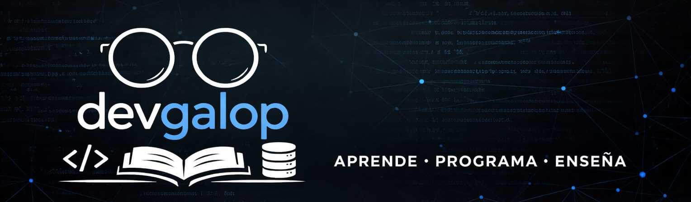

# Hola, 👋 soy Alexander García

---

[🇺🇸](README.md)

Ingeniero de Software Senior con más de **6 años de experiencia** en el diseño y desarrollo de **sistemas backend escalables y de alto rendimiento**. Especializado en **.NET**, **APIs REST** y **arquitecturas basadas en eventos**, con experiencia en entornos **cloud** y plataformas capaces de procesar **millones de registros mensuales**.

Me apasiona la **educación**, el **aprendizaje continuo** y sobretodo **compartir conocimiento**. Disfruto enfrentar **retos técnicos**, tomar **decisiones de arquitectura** y construir soluciones **simples, eficientes y mantenibles** que generen impacto real.

---

## 🧠 Architecture Mindset

- Diseño de sistemas **escalables, desacoplados y resilientes**
- Enfoque en **arquitecturas orientadas a eventos**
- Toma de decisiones técnicas basadas en **impacto, mantenibilidad y costo**
- Reducción de **deuda técnica** y mejora continua del código
- Pensamiento orientado a **performance, observabilidad y confiabilidad**

---

## 🛠️ Tecnologías y Herramientas

### Backend

- .NET (Framework, Core, .NET 6+)
- C#
- Python
- APIs REST
- Arquitecturas basadas en eventos

### Cloud

- AWS
- Azure
- Contenedores (Docker)

### Mensajería

- RabbitMQ
- AWS SQS & SNS

### Bases de Datos

- SQL Server
- Oracle
- MongoDB

### Automatización & Data

- Python
- RPA (UiPath, Automation Anywhere)
- ETL y análisis de datos

### Otros

- Git & GitHub
- CI/CD Fundamentos
- Refactorización de sistemas Legacy

---

## 🚀 Lo que me motiva

- Construir soluciones que **escalen en producción**
- Automatizar procesos y **optimizar tiempos y costos**
- Diseñar sistemas que puedan **evolucionar sin fricción**
- Compartir conocimiento y **mentorear a otros desarrolladores**

---

## 🌎 Idiomas

- Español (Nativo)
- Inglés (Intermedio)

---

## 📫 Conectemos

- 💼 LinkedIn: https://linkedin.com/in/devgalop
- 🌐 Portfolio: https://devgalop.github.io
- 📧 Email: devgalop@gmail.com

---

⭐ *“Disfuto construir sistemas que sean simples, confiables y rápidos — incluso cuando los problemas son complejos.”*